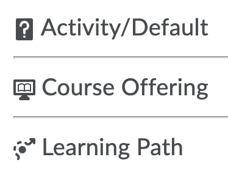
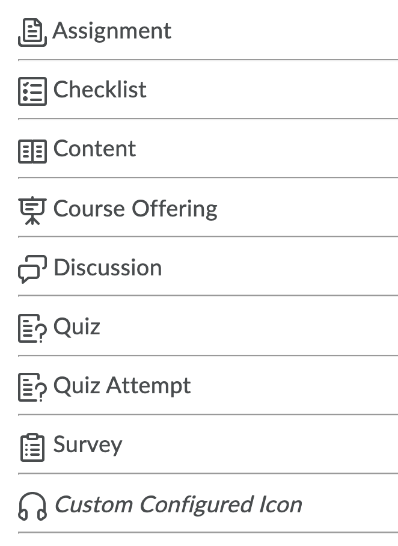

# d2l-activity-icon

Shows the `d2l-icon` associated with the activity based on its classes.
Activities may also be configured to use a custom `tier2` icon with a sub-entity.

## Tier 1 Standard Activity Icons

These icons are typically used in lists.

## Tier 2 User-specific Activity Icons

These icons are used in Work-to-do widget and anywhere where the activity is specific to the user.

